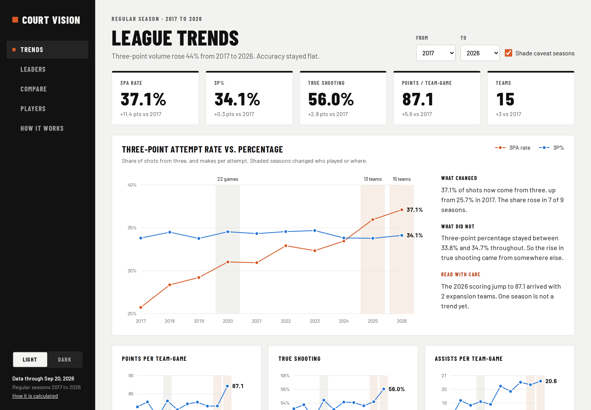
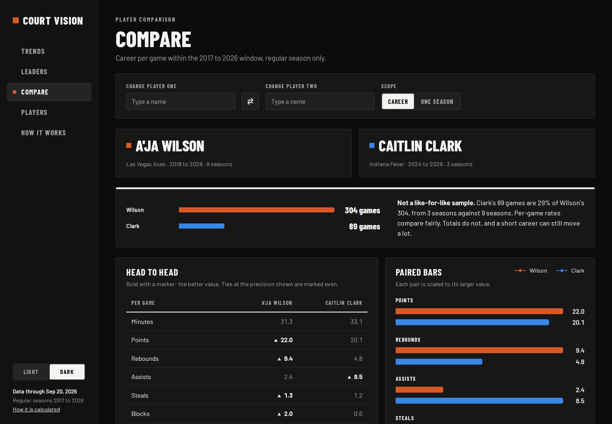
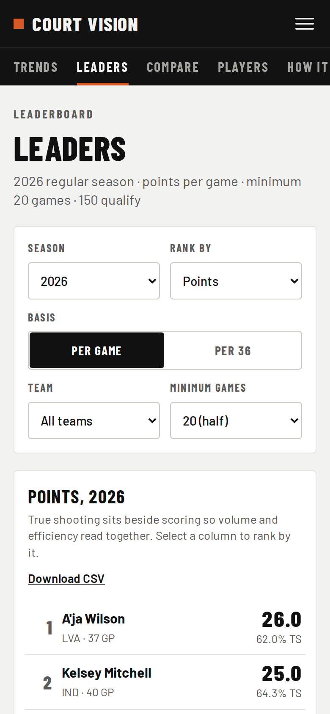
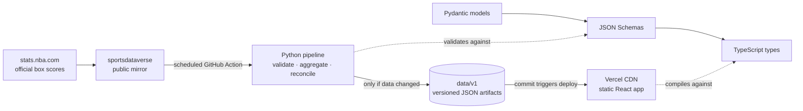

# Court Vision

How the WNBA's game changed from 2017 to 2026: league trends, leaders, player profiles and head-to-head comparisons, with the caveats stated plainly.

**Live site: [court-vision-snowy.vercel.app](https://court-vision-snowy.vercel.app)**



<p>
  
  
</p>

## What the data shows

Ten regular seasons, every number computed from team and player box scores. The full treatment is on the site; this is the argument in brief.

**Teams shoot far more threes.** In 2017, 25.7% of shots came from three. In 2026 it was 37.1%, and the share rose in seven of the nine seasons between. Attempts per team-game went from 17.5 to 25.4.

**They do not make them any better.** League three-point percentage stayed between 33.8% and 34.7% for the whole decade. More threes, not better threes.

**Efficiency still rose, and the twos explain it.** True shooting climbed from 53.2% to 56.0%. With three-point accuracy flat, the gain came from the rest of the shot chart:

- **Two-point shooting improved.** Two-point percentage rose from 47.6% to 51.8% (derived from the published field goal, three-point rate and three-point percentage figures), and 3.0 points of that 4.2-point rise came in 2025 and 2026.
- **Free throws picked up.** Teams averaged 20.8 free throw attempts per game in 2026, the most in the window.
- **Twos overtook threes.** In 2026, for the first time in the window, a two-point attempt (1.04 points) was worth more than a three (1.02).

**And the latest season needs an asterisk.** Scoring jumped from 81.7 to 87.1 points per team-game in 2026, the same season the league expanded from 13 to 15 teams. Expansion changes who is on the floor as well as how they play, so one season is not yet a trend. The site shades 2020 (a 22-game bubble), 2025 and 2026 on every chart for exactly this reason.

## Architecture



**Why the pipeline is decoupled from serving.** The first version of this project was a Streamlit app that called the stats API live. It slept when idle, needed a bot to keep it awake, and every visitor waited on a slow third-party endpoint. Court Vision splits the work instead. A scheduled job does all of the analysis ahead of time and publishes finished answers as static JSON. The website only draws them. There is no server to fall asleep and no API call on page load. If the source goes down, the site keeps serving the last good data and says how old it is.

**Why a mirror and not the official API.** stats.nba.com silently drops traffic from cloud data centers, which is where every scheduled job runs. A spike (in `spikes/`) proved a GitHub runner cannot reach it. The pipeline reads the sportsdataverse mirror, which republishes the same box scores through GitHub releases.

**One contract, enforced on both sides.** The artifacts are defined once, as Pydantic models. Those generate the JSON Schemas in `schemas/`, which generate the TypeScript types the frontend imports. CI regenerates both and fails on any drift. A field renamed in Python becomes a TypeScript compile error, not a blank chart in production.

## Data integrity

The pipeline refuses to publish anything it cannot verify:

- **Reconciliation.** Player lines must add up to team totals, game by game, for every stat except turnovers (teams are charged turnovers that no player is). In 2026 that is 600 of 600 team-games.
- **Coverage.** When the mirror's 2026 player file stopped short, the 98 missing games were filled from box scores and passed the same reconciliation before publishing. A season that cannot be completed is flagged, and the site shows a banner on every page.
- **All or nothing.** A failure at any stage leaves the published data untouched. Writes are atomic, and a content fingerprint means a run that finds nothing new commits nothing.
- **Franchise continuity.** The source identifies teams by an ID, and an ID is not a franchise. A registry keeps Phoenix's PHO to PHX relabel on one line and San Antonio's move to Las Vegas continuous. It also keeps the 2026 Portland Fire separate from the 2000 to 2002 team that shared its ID. The Connecticut Sun's 2027 move to Houston is already registered.
- **Honest numbers.** A rate with no attempts is null, never zero. Short seasons are drawn as open circles, and missed seasons stay as gaps. Comparisons state their sample size before showing a single stat.

The methodology is written up for readers on the site's [How it Works](https://court-vision-snowy.vercel.app/how-it-works) page.

## Stack

| Layer | Choices |
|---|---|
| Pipeline | Python 3.12, pandas, Pydantic, PyArrow; uv for locked dependencies; pytest and ruff |
| Contract | JSON Schema generated from Pydantic; TypeScript generated by json-schema-to-typescript |
| Frontend | React 19, TypeScript 7, React Router, Tailwind CSS 4, Vite; hand-built SVG charts |
| Quality | Vitest and Testing Library; oxlint; a gzip performance budget checked in CI |
| Automation | GitHub Actions: CI on every push, a scheduled data refresh with a keepalive, actions pinned by commit SHA |
| Hosting | Vercel, with a strict Content-Security-Policy and content-addressed data caching |

The charts are hand-built rather than drawn with a library. The design needs things chart libraries make awkward: shaded caveat seasons labeled on the chart, open markers for short seasons, and lines that break where a player missed a year. Building them this way also keeps the whole app near 130 kB gzipped. Every chart can be read with the keyboard, works in light and dark themes, and never uses color as the only way to tell series apart.

## Repository layout

```
pipeline/     Python package: ingest, transform, metrics, artifact build, CLI, tests
data/v1/      Published artifacts: manifest, league trends, player seasons, careers, franchises
schemas/      JSON Schemas and the generated TypeScript types
web/          The React site (see web/README.md)
.github/      CI and the scheduled refresh
spikes/       One-off experiments that settled the data source and the season mapping
```

## Running it locally

Pipeline (needs [uv](https://docs.astral.sh/uv/)):

```bash
cd pipeline
uv sync --extra dev
uv run pytest -q                  # the test suite
uv run courtvision build          # rebuild data/v1 from the mirror
uv run courtvision validate       # check the artifacts against the contract
uv run courtvision summary        # Markdown report of what was published
```

Frontend (Node 22):

```bash
cd web
npm ci
npm run dev                       # http://localhost:5173, reads ../data/v1
npm run check                     # lint, typecheck, tests, build, performance budget
```

## Automation

- **CI** runs three jobs on every push: the pipeline (lint, tests, schema drift, data validation), the TypeScript contract (regenerated types must match), and the web app (lint, typecheck, tests, build, budget).
- **Refresh** runs daily from May through October and weekly the rest of the year. The full test suite runs before any build, and data is committed only if it changed. Each commit redeploys the site. A keepalive stops GitHub from disabling the schedule during the quiet off-season.

## Background

Court Vision started as a Jupyter notebook exploring WNBA stats, then became a Streamlit dashboard. This version rebuilds it as a production system: a tested pipeline, a versioned data contract, and a static site that loads instantly anywhere. The notebook and Streamlit files at the repository root are from those earlier versions.

---

Built by **Keyaira Austin**. Data from stats.nba.com via [sportsdataverse](https://github.com/sportsdataverse/wehoop-wnba-stats-data). Court Vision is an independent project and is not affiliated with the WNBA.
